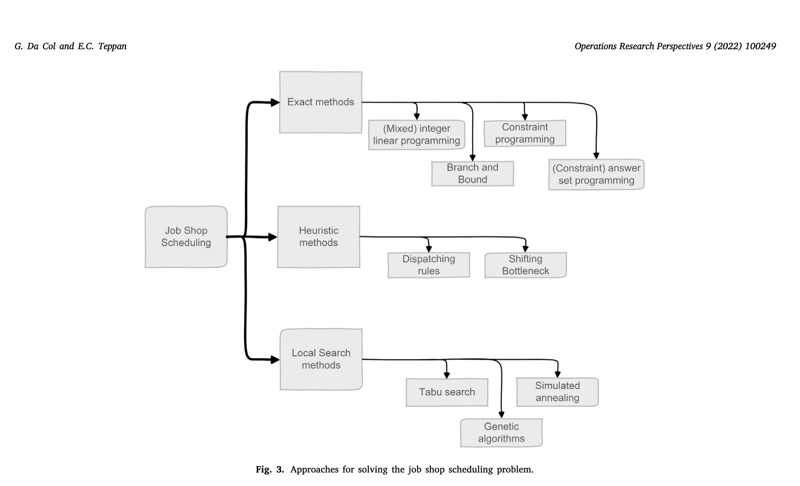

# Industrial-size job shop scheduling with constraint programming

- cite

- text [1-s2.0-S2214716022000215-main](../texts/1-s2.0-S2214716022000215-main.pdf)


This paper presents a comprehensive evaluation of state-of-the-art constraint programming (CP) solvers on industrial-size job shop scheduling problems. Here are the key points and their industrial importance:

## Key Findings

### **1. CP Solvers Can Handle Industrial-Scale Problems**
The paper demonstrates that modern CP solvers (IBM CP Optimizer and Google OR-Tools) can effectively solve job shop scheduling problems with **up to 1 million operations on 1000 machines** - scales that reflect real industrial workloads, particularly in semiconductor manufacturing.

### **2. Significant Performance Differences Between Solvers**
- **CP Optimizer (CPO)** consistently outperformed OR-Tools, especially on larger instances
- CPO solved instances up to 1 million operations, while OR-Tools struggled with problems beyond 100,000 operations
- On classic benchmarks, both solvers achieved ~75% optimal solutions, but the gap widened dramatically with scale

### **3. Multi-Core Benefits Vary by Solver and Problem Size**
- **OR-Tools** benefited more from additional cores across most problem sizes
- **CP Optimizer** showed limited improvement with more cores on smaller problems but significant gains on the largest instances (1000×1000) due to "Iterative Diving" strategy

### **4. CP Approaches Match State-of-the-Art Performance**
CP Optimizer achieved state-of-the-art results on 58 out of 74 classic benchmark instances, demonstrating that CP is competitive with specialized algorithms from literature.

## Industrial Importance

### **1. Bridging the Academic-Industry Gap**
The paper addresses a critical disconnect: academic benchmarks typically involve 100-2000 operations, while real industrial scenarios (especially semiconductor manufacturing) require scheduling **100,000+ operations weekly**. This work shows CP can handle real-world scales.

### **2. Practical Solver Selection Guidance**
For industrial practitioners, the paper provides clear guidance:
- **CP Optimizer** for maximum performance, especially on large problems
- **OR-Tools** as a viable open-source alternative for smaller-to-medium problems
- Multi-core deployment recommendations based on problem characteristics

### **3. Declarative Programming Advantages for Industry**
The paper emphasizes CP's industrial benefits:
- **Compact, maintainable code** (80% maintenance cost reduction reported at Siemens)
- **Easy adaptability** to changing requirements
- **Logic-based modeling** that's easier to verify and modify than procedural approaches

### **4. Real-World Validation**
By testing on problems with industrial-representative sizes and creating benchmarks inspired by semiconductor manufacturing, the paper validates that CP isn't just academically interesting but **industrially viable** for current automation and Industry 4.0 initiatives.

### **5. Performance Benchmarks for Procurement Decisions**
The detailed performance analysis helps industrial decision-makers choose appropriate solver technologies based on their specific problem scales, hardware configurations, and performance requirements.

## Why This Matters for Industry 4.0

As manufacturing moves toward full automation, the ability to solve large-scale scheduling problems in reasonable time (overnight scenarios) becomes crucial. This paper demonstrates that CP technology has matured to handle the complexity and scale demands of modern automated production systems, making it a viable foundation for intelligent manufacturing systems.

The work essentially proves that **constraint programming has evolved from an academic curiosity to an industrial-strength technology** capable of supporting the scheduling demands of modern manufacturing at scale.


# Job Shop Scheduling Problem Definition

The mathematical formulation of the Job Shop Scheduling Problem (JSSP) from Section 2.1 in detail.

## Problem Components

### **Basic Elements**
- **M**: Set of machines (physical resources like CNC machines, ovens, assembly stations)
- **J**: Set of jobs (products or orders to be manufactured)

### **Job Structure**
For each job j ∈ J, we have:
- **Sequence of operations**: ⟨j₁, j₂, ..., j_last_j⟩
- Each operation must be completed in this exact order
- **Predecessor/Successor relationships**:
  - jᵢ₋₁ is the predecessor of jᵢ (must finish before jᵢ can start)
  - jᵢ₊₁ is the successor of jᵢ (cannot start until jᵢ finishes)

### **Operation Properties**
For each operation x:
- **machine_x ∈ M**: The specific machine that processes this operation
- **length_x ∈ ℕ**: Processing time (duration) of the operation
- **No preemption**: Once started, an operation cannot be interrupted

## Mathematical Constraints

### **Decision Variables**
- **start_x**: Starting time of operation x (this is what we're solving for)

### **Constraint 1: Precedence Constraint**
```
start_j_{i+1} ≥ start_j_i + length_j_i, for i ∈ {1, ..., last_j - 1}
```

**Explanation**: 
- The next operation in a job cannot start until the current operation finishes
- If operation jᵢ starts at time 10 and takes 5 time units, then jᵢ₊₁ cannot start before time 15

**Example**: 
- Job: Paint → Dry → Pack
- If Paint starts at time 0 and takes 3 hours, Dry cannot start before time 3
- If Dry takes 2 hours, Pack cannot start before time 5

### **Constraint 2: NoOverlap Constraint**
For operations x ≠ y with machine_x = machine_y:

```
start_x ≠ start_y                                    (2)
start_x < start_y ⇒ start_y ≥ start_x + length_x    (3)
```

**Explanation**:
- Equation (2): No two operations can start at exactly the same time on the same machine
- Equation (3): If operation x starts before y, then y must wait until x completely finishes

**Example**:
- Machine M1 processes both Operation A (starts at 10, duration 5) and Operation B
- Operation B cannot start at time 10 (equation 2)
- If Operation B starts after A, it must start at time 15 or later (equation 3)

## Objective Function

### **Makespan Minimization**
```
max{start_j_{last_j} + length_j_{last_j} | j ∈ J} → min    (4)
```

**Explanation**:
- For each job j, find when its last operation finishes: start_j_{last_j} + length_j_{last_j}
- The makespan is the maximum finishing time across all jobs
- Goal: Minimize this maximum completion time

**Example**:
- Job 1 finishes at time 20
- Job 2 finishes at time 25  
- Job 3 finishes at time 18
- Makespan = max(20, 25, 18) = 25
- We want to find a schedule that minimizes this value

## Concrete Example

Let's trace through the beer brewery example from the paper:

**Given**:
- 3 Machines: M1 (Capping), M2 (Labeling), M3 (Filling)
- 3 Jobs (Products): Product 1, Product 2, Product 3

**Operations and Processing Times**:
- Product 1: M1(2) → M2(1) [already filled]
- Product 2: M2(4) → M3(2) → M1(3)
- Product 3: M2(2) → M3(2) → M1(1)

**Applying Constraints**:

1. **Precedence for Product 2**:
   - start_M3 ≥ start_M2 + 4 (labeling must finish before filling)
   - start_M1 ≥ start_M3 + 2 (filling must finish before capping)

2. **NoOverlap for Machine M2** (handles Products 1, 2, 3):
   - All three operations on M2 cannot overlap
   - If Product 1 uses M2 from time 2-3, Product 2 cannot start M2 before time 3

3. **Optimal Solution** (from the paper):
   - Product 1: M1(0-2) → M2(2-3)
   - Product 2: M2(3-7) → M3(7-9) → M1(5-8) ❌ This violates precedence!
   
   **Corrected**:
   - Product 2: M2(0-4) → M3(4-6) → M1(6-9) ❌ Still wrong!
   
   **Actually from the figure**:
   - Product 2: M2(0-4) → M3(4-6) → M1(6-8)
   - The makespan is 8 (when all jobs complete)

This mathematical formulation ensures that:
1. **Feasibility**: All technological constraints (job sequences) are respected
2. **Resource constraints**: No machine conflicts occur  
3. **Optimality**: The schedule minimizes total completion time

The beauty of this formulation is that it's **declarative** - you specify what constraints must hold, and the CP solver figures out how to satisfy them optimally.


# Approach for solving JSSP



Based on Section 2.3, here's a comprehensive summary of the solving approaches for the Job Shop Scheduling Problem (JSSP):

## **Exact Optimization Methods**

### **1. Mixed Integer Linear Programming (MILP)**
**Timeline**: First approaches from late 1950s
- **Key Contributors**: Wagner (1959), Bowman (1959), Manne (1960)
- **Mechanism**: Uses integer variables to model ordering decisions between operations
- **Foundation**: Built on simplex algorithm (1947) + Gomory's integer algorithm (1958)
- **Current Status**: Manne's 1960 formulation still performs best among MILP approaches
- **Strength**: Mature, well-established mathematical framework

### **2. Branch and Bound**
**Core Concept**: Systematic enumeration organized as a search tree
- **Tree Structure**: Each branch represents a scheduling choice (which operation to schedule next)
- **Lower Bounds**: Calculate optimistic estimates to prune unpromising branches
- **Pruning Logic**: If lower bound > current best solution, eliminate entire branch
- **Relaxation Techniques**: Use simplified subproblems (e.g., m one-machine problems)
- **Historic Achievement**: Carlier (1989) used this to solve the famous Fisher-Thompson 10×10 instance

### **3. Constraint Programming (CP)**
**Timeline**: Started in 1980s
- **Pioneer**: Mark Fox (1982) - first constraint reasoning system for scheduling
- **Evolution**: Keng & Yun (1989) introduced domain-independent policies
- **Search Strategy**: Branch-and-propagate using constraint propagation instead of LP relaxations
- **Advantages**: Handles complex logical constraints naturally
- **Modern Development**: Advanced propagation schemes, global constraints

### **4. Answer Set Programming (ASP)**
- **Foundation**: Based on stable model semantics and predicate logic
- **Strengths**: High-level problem representation, aggregate functions
- **Weakness**: Expensive "grounding" step (converting to propositional logic)
- **Challenge**: Every time-point must be explicitly represented

## **Heuristic Methods**

### **5. Priority Rules (Dispatching Rules)**
**Concept**: Simple ordering rules based on operation attributes
- **Examples**: 
  - Shortest Processing Time (SPT)
  - Longest Processing Time (LPT) 
  - Number of remaining operations
- **Advantages**: 
  - Extremely fast computation
  - Good for large-scale problems
  - Easy to implement
- **Limitations**: Don't guarantee optimal solutions
- **Evolution**: Can be combined into hyper-heuristics

### **6. Hyper-Heuristics**
- **Concept**: Methods that select and combine simple heuristics
- **Advanced Form**: Hyper-hyper-heuristics (methods that select hyper-heuristics)
- **Purpose**: Create more powerful composite approaches

## **Iterative/Local Search Methods**

### **7. Shifting Bottleneck Procedure**
**Strategy**: Iteratively identify and optimize bottleneck machines
- **Process**:
  1. Start with initial schedule
  2. Identify bottleneck machine (busiest)
  3. Use Carlier's one-machine algorithm to optimize that machine
  4. Adapt schedule on other machines
  5. Find new bottleneck and repeat
- **Key Improvement**: Balas & Vazacopoulos used better one-machine algorithms

### **8. Tabu Search (TS)**
**Most Effective Local Search for JSSP**

#### **Taillard (1992) - Original Approach**:
- **Neighborhood**: Based on critical path concept
- **Tabu List**: Prevents undoing recent moves
- **Critical Path**: Sequence of operations most responsible for current makespan

#### **Dell'Amico & Trubian (1993)**:
- **Improvement**: Better initial solution heuristic
- **Focus**: Enhanced starting point rather than search mechanism

#### **Nowicki & Smutnicki (1996) - Major Breakthrough**:
- **Key Innovation**: Block-based neighborhood
- **Critical Path Blocks**: Consecutive operations on same machine within critical path
- **Neighborhood Definition**: Only swap operations at block boundaries
- **Impact**: Dramatically reduced search space while maintaining solution quality

#### **Enhanced Version (2005)**:
- **Further Refinements**: Improved algorithm components
- **Legacy**: Spawned many hybrid approaches combining TS with other methods

### **9. Hybrid Approaches**
- **TS + Simulated Annealing**: Combines tabu search with probabilistic acceptance
- **TS + Evolutionary Algorithms**: Population-based enhancement of tabu search
- **Success Factor**: Leverage strengths of multiple methodologies

## **Key Insights and Trade-offs**

### **Exact vs. Heuristic Trade-off**:
- **Exact Methods**: 
  - ✅ Guarantee optimal solutions
  - ✅ Provide optimality proofs
  - ❌ Don't scale well to large instances
  
- **Heuristic Methods**:
  - ✅ Handle large-scale problems
  - ✅ Fast computation
  - ❌ No optimality guarantee
  - ✅ Good practical performance

### **Historical Progression**:
1. **1950s-1960s**: Mathematical programming foundations
2. **1970s-1980s**: Branch and bound refinements  
3. **1990s**: Local search revolution (especially Tabu Search)
4. **2000s+**: Hybrid approaches and constraint programming revival

### **Problem Scale Reality**:
The paper notes a critical gap: **academic benchmarks (100-2000 operations) vs. industrial reality (100,000+ operations)**. This scale difference explains why:
- Exact methods dominate academic literature
- Heuristic methods dominate industrial practice
- Modern CP approaches aim to bridge this gap

### **Modern Trend**:
The paper advocates for **constraint programming** as it combines:
- **Declarative modeling** (like mathematical programming)
- **Scalability** (approaching heuristic methods)
- **Maintainability** (crucial for industrial deployment)

This comprehensive landscape shows how JSSP solving has evolved from pure mathematical optimization toward practical, scalable approaches that can handle real-world industrial requirements.

# JSSP model by Constraint Programming and Google's ORT implementation

Looking at Section 3.1, I'll explain the key differences between the classic model (2.1) and the constraint programming model, then provide the OR-Tools Python implementation.

## Key Differences Between Classic Model (2.1) and CP Model (3.1)

### **1. Variable Types**
**Classic Model (2.1)**:
- Uses **integer variables** `start_x` for each operation's start time
- Requires separate variables for start times, lengths, and end times

**CP Model (3.1)**:
- Uses **interval variables** `ops[j][m]` that automatically encapsulate:
  - Start time
  - Duration (length)  
  - End time
- Built-in constraint: `start + length = end`

### **2. Constraint Representation**
**Classic Model (2.1)**:
- **Precedence**: Manual arithmetic constraints `start_{j+1} ≥ start_j + length_j`
- **NoOverlap**: Complex logical constraints with disjunctions

**CP Model (3.1)**:
- **Precedence**: High-level constraint `ops[j][m].end ≤ ops[j][opSuccessor[j][m]].start`
- **NoOverlap**: Single global constraint `noOverlap([ops[j][m] for all jobs j on machine m])`

### **3. Input Structure**
**Classic Model**: Abstract mathematical notation
**CP Model**: Concrete data structures:
- `opLength[j][m]`: Duration of job j's operation on machine m
- `opSuccessor[j][m]`: Next machine in job j's sequence after machine m

### **4. Modeling Philosophy**
- **Classic**: Procedural - specify HOW to solve
- **CP**: Declarative - specify WHAT constraints must hold

## OR-Tools Python Implementation

Here's the complete implementation based on the CP model from Section 3.1:

```python
from ortools.sat.python import cp_model
import random

def solve_jssp_ortools(job_data, processing_times):
    """
    Solve Job Shop Scheduling Problem using OR-Tools CP-SAT
    
    Args:
        job_data: List of lists, where job_data[j] = [m1, m2, m3, ...] 
                 represents the machine sequence for job j
        processing_times: List of lists, where processing_times[j][i] 
                         is the duration of job j's i-th operation
    
    Returns:
        Dictionary with solution details
    """
    
    # Create the model
    model = cp_model.CpModel()
    
    # Problem dimensions
    num_jobs = len(job_data)
    num_machines = max(max(job) for job in job_data) + 1
    
    # Calculate horizon (upper bound on makespan)
    horizon = sum(sum(processing_times[j]) for j in range(num_jobs))
    
    print(f"Problem: {num_jobs} jobs, {num_machines} machines")
    print(f"Horizon: {horizon}")
    
    # Create interval variables for each operation
    # ops[j][i] represents the i-th operation of job j
    ops = []
    for j in range(num_jobs):
        job_ops = []
        for i in range(len(job_data[j])):
            machine = job_data[j][i]
            duration = processing_times[j][i]
            
            # Create interval variable: [start, start + duration)
            op_var = model.NewIntervalVar(
                start=0,
                size=duration, 
                end=horizon,
                name=f'job_{j}_op_{i}_machine_{machine}'
            )
            job_ops.append(op_var)
        ops.append(job_ops)
    
    # CONSTRAINT 1: Precedence constraints
    # Each operation in a job must finish before the next one starts
    for j in range(num_jobs):
        for i in range(len(job_data[j]) - 1):
            model.Add(ops[j][i].EndExpr() <= ops[j][i + 1].StartExpr())
    
    # CONSTRAINT 2: NoOverlap constraints  
    # Operations on the same machine cannot overlap
    machine_ops = [[] for _ in range(num_machines)]
    
    # Group operations by machine
    for j in range(num_jobs):
        for i in range(len(job_data[j])):
            machine = job_data[j][i]
            machine_ops[machine].append(ops[j][i])
    
    # Add NoOverlap constraint for each machine
    for machine in range(num_machines):
        if machine_ops[machine]:  # Only if machine has operations
            model.AddNoOverlap(machine_ops[machine])
    
    # OBJECTIVE: Minimize makespan
    # Makespan = maximum end time of all operations
    makespan = model.NewIntVar(0, horizon, 'makespan')
    
    # Makespan must be >= end time of every operation
    for j in range(num_jobs):
        if job_data[j]:  # If job has operations
            last_op = ops[j][-1]  # Last operation of job j
            model.Add(makespan >= last_op.EndExpr())
    
    # Minimize makespan
    model.Minimize(makespan)
    
    # Solve the model
    solver = cp_model.CpSolver()
    solver.parameters.max_time_in_seconds = 60  # 1 minute timeout
    
    print("Solving...")
    status = solver.Solve(model)
    
    # Process results
    if status == cp_model.OPTIMAL or status == cp_model.FEASIBLE:
        print(f"\nSolution found!")
        print(f"Optimal makespan: {solver.ObjectiveValue()}")
        print(f"Solve time: {solver.WallTime():.3f} seconds")
        
        # Extract schedule
        schedule = []
        for j in range(num_jobs):
            job_schedule = []
            for i, op in enumerate(ops[j]):
                start_time = solver.Value(op.StartExpr())
                end_time = solver.Value(op.EndExpr())
                machine = job_data[j][i]
                
                job_schedule.append({
                    'job': j,
                    'operation': i,
                    'machine': machine,
                    'start': start_time,
                    'end': end_time,
                    'duration': processing_times[j][i]
                })
            schedule.append(job_schedule)
        
        return {
            'status': 'OPTIMAL' if status == cp_model.OPTIMAL else 'FEASIBLE',
            'makespan': solver.ObjectiveValue(),
            'schedule': schedule,
            'solve_time': solver.WallTime()
        }
    
    else:
        print(f"No solution found. Status: {status}")
        return {'status': 'FAILED'}

def print_schedule(result):
    """Print the schedule in a readable format"""
    if result['status'] == 'FAILED':
        print("No solution to print")
        return
        
    print(f"\n=== SCHEDULE (Makespan: {result['makespan']}) ===")
    
    # Print by job
    for j, job_schedule in enumerate(result['schedule']):
        print(f"\nJob {j}:")
        for op in job_schedule:
            print(f"  Op {op['operation']}: Machine {op['machine']} "
                  f"[{op['start']}-{op['end']}] (duration: {op['duration']})")
    
    # Print by machine
    print(f"\n=== BY MACHINE ===")
    all_ops = []
    for job_schedule in result['schedule']:
        all_ops.extend(job_schedule)
    
    # Group by machine
    machine_schedules = {}
    for op in all_ops:
        machine = op['machine']
        if machine not in machine_schedules:
            machine_schedules[machine] = []
        machine_schedules[machine].append(op)
    
    # Sort by start time and print
    for machine in sorted(machine_schedules.keys()):
        ops = sorted(machine_schedules[machine], key=lambda x: x['start'])
        print(f"\nMachine {machine}:")
        for op in ops:
            print(f"  Job {op['job']}-Op {op['operation']}: "
                  f"[{op['start']}-{op['end']}]")

# Example from the paper (Beer Brewery)
def beer_brewery_example():
    """Beer brewery example from Figure 2 in the paper"""
    
    # Job sequences (machine indices)
    # Product 1: Capping(0) -> Labeling(1) 
    # Product 2: Labeling(1) -> Filling(2) -> Capping(0)
    # Product 3: Labeling(1) -> Filling(2) -> Capping(0)
    job_data = [
        [0, 1],        # Product 1: M1 -> M2  
        [1, 2, 0],     # Product 2: M2 -> M3 -> M1
        [1, 2, 0]      # Product 3: M2 -> M3 -> M1
    ]
    
    # Processing times for each operation
    processing_times = [
        [2, 1],        # Product 1: 2 time units on M1, 1 on M2
        [4, 2, 3],     # Product 2: 4 on M2, 2 on M3, 3 on M1  
        [2, 2, 1]      # Product 3: 2 on M2, 2 on M3, 1 on M1
    ]
    
    print("=== BEER BREWERY SCHEDULING ===")
    print("Machines: M0=Capping, M1=Labeling, M2=Filling")
    
    result = solve_jssp_ortools(job_data, processing_times)
    print_schedule(result)
    
    return result

# Larger example
def generate_random_jssp(num_jobs, num_machines, seed=42):
    """Generate a random JSSP instance"""
    random.seed(seed)
    
    job_data = []
    processing_times = []
    
    for j in range(num_jobs):
        # Random permutation of machines for each job
        machines = list(range(num_machines))
        random.shuffle(machines)
        
        # Random processing times (1-10)
        times = [random.randint(1, 10) for _ in range(num_machines)]
        
        job_data.append(machines)
        processing_times.append(times)
    
    return job_data, processing_times

def large_example():
    """Solve a larger random instance"""
    print("\n=== LARGER EXAMPLE ===")
    
    job_data, processing_times = generate_random_jssp(6, 4)
    
    print("Job sequences:")
    for j, seq in enumerate(job_data):
        print(f"  Job {j}: {' -> '.join(f'M{m}' for m in seq)}")
    
    result = solve_jssp_ortools(job_data, processing_times)
    print_schedule(result)
    
    return result

if __name__ == "__main__":
    # Run examples
    beer_result = beer_brewery_example()
    large_result = large_example()
```

## Key Features of This Implementation

### **1. Interval Variables**
```python
op_var = model.NewIntervalVar(start=0, size=duration, end=horizon, name=...)
```
- Automatically handles start + duration = end
- More compact than separate variables

### **2. High-Level Constraints**
```python
# Precedence: much simpler than arithmetic constraints
model.Add(ops[j][i].EndExpr() <= ops[j][i + 1].StartExpr())

# NoOverlap: single global constraint per machine  
model.AddNoOverlap(machine_ops[machine])
```

### **3. Flexible Input Format**
- `job_data`: Machine sequences for each job
- `processing_times`: Duration of each operation
- Handles variable-length jobs naturally

### **4. Complete Solution Extraction**
- Returns detailed schedule with start/end times
- Organized by both jobs and machines
- Includes solver statistics

This implementation demonstrates how the CP model from Section 3.1 translates directly into clean, maintainable code that's much more concise than implementing the mathematical constraints from Section 2.1 manually.

