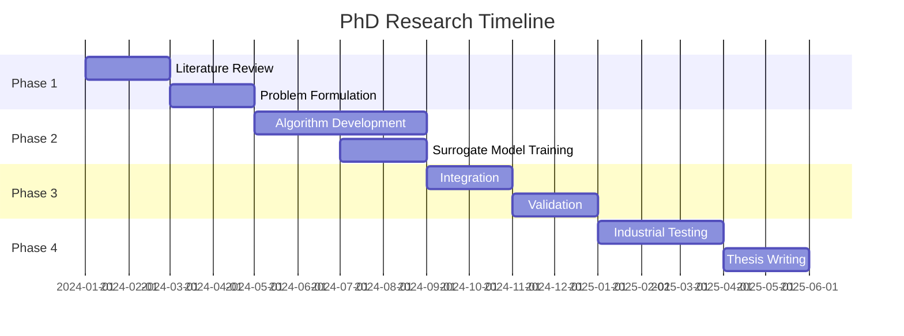

# Research Plan: Hybrid Hierarchical Optimization for TFT-LCD Manufacturing Supply Chain

## 1. Research Background

### 1.1 Industrial Context

The TFT-LCD (Thin-Film-Transistor Liquid-Crystal Display) manufacturing industry represents one of the most complex supply chain systems in modern manufacturing, characterized by:

- **High capital intensity**: Equipment costs exceeding billions USD per fab
- **Complex product mix**: Multiple product families (TV, Monitor, Handheld) with varying specifications
- **Multi-stage production**: Front-end (TFT array/cell fabrication) and back-end (module assembly)
- **Global distribution**: Manufacturing sites across different regions with varying capabilities
- **Dynamic market demand**: Rapid technology evolution and seasonal fluctuations

### 1.2 Current Challenges in TFT-LCD Manufacturing

```
Industry Pain Points:
├── Strategic Level
│   ├── Capacity allocation across sites
│   ├── Product mix optimization
│   └── Long-term investment decisions
├── Tactical Level
│   ├── Inter-site coordination
│   ├── Material flow synchronization
│   └── Production campaign planning
└── Operational Level
    ├── Real-time scheduling
    ├── Resource bottleneck management
    └── Quality yield optimization
```

### 1.3 Research Motivation

Current approaches fail to address the **multi-scale nature** of TFT-LCD manufacturing:
- **Monolithic models** become computationally intractable at industrial scale
- **Decomposed approaches** lose critical interdependencies
- **Commercial solutions** lack flexibility for industry-specific constraints

## 2. Problem Statement

### 2.1 Core Research Questions

**Primary Question**: How can we develop a computationally tractable optimization framework that effectively coordinates decisions across enterprise, site, and resource levels in TFT-LCD manufacturing?

**Sub-questions**:
1. How to decompose the global optimization problem while maintaining solution quality?
2. What information should flow between hierarchical levels?
3. How to handle different time scales (strategic: months, tactical: weeks, operational: hours)?
4. When and how should surrogate models replace detailed resource modeling?

### 2.2 Specific Problems to Solve

#### **P1: Multi-Scale Coordination Problem**
```python
# Mathematical formulation
minimize: Total_Cost = Production_Cost + Inventory_Cost + Transportation_Cost + Penalty_Cost
subject to:
    - Global demand satisfaction
    - Site capacity constraints  
    - Inter-site material flow balance
    - Resource availability constraints
    - Quality specifications
    
Variables span:
    - Top: Product allocation X[product, site, period]
    - Middle: Production schedule Y[job, machine, time]
    - Bottom: Resource utilization Z[resource, task, time]
```

#### **P2: Information Asymmetry Problem**
- Top level lacks detailed resource visibility
- Site level has local information not shared globally
- Resource level dynamics not captured in planning

#### **P3: Computational Tractability Problem**
- Full problem has ~10^6 decision variables
- Real-time requirements at operational level
- Planning horizon spans 3-6 months

## 3. Proposed Research Framework

### 3.1 Hierarchical Architecture

```
┌─────────────────────────────────────────┐
│   Top Level: Enterprise Optimization    │
│   Method: GA/PSO or MIP                 │
│   Horizon: 3-6 months                   │
│   Decisions: Capacity, Product Mix      │
└────────────┬────────────────────────────┘
             │ Targets & Constraints
             ▼
┌────────────────────────────────────────────────┐
│   Middle Level: Site Optimization              │
│   ┌──────────┐  ┌──────────┐  ┌──────────┐   │
│   │Front-End │  │Front-End │  │Back-End  │   │
│   │  Site 1  │  │  Site 2  │  │  Site 3  │   │
│   └──────────┘  └──────────┘  └──────────┘   │
│   Method: CP Solver (OR-Tools, CP-SAT)        │
│   Horizon: 1-4 weeks                          │
└────────────┬───────────────────────────────────┘
             │ Schedules & Resource Requests
             ▼
┌────────────────────────────────────────────────┐
│   Bottom Level: Resource Optimization          │
│   ┌──────────┐  ┌──────────┐  ┌──────────┐   │
│   │Equipment │  │ Material │  │  Human   │   │
│   │ Surrogate│  │ Surrogate│  │ Surrogate│   │
│   └──────────┘  └──────────┘  └──────────┘   │
│   Method: Neural Networks/Gaussian Process     │
│   Horizon: Real-time to hours                  │
└─────────────────────────────────────────────────┘
```

### 3.2 Research Methodology

#### **Phase 1: Problem Formulation and Decomposition (Months 1-3)**

**Objectives**:
- Develop mathematical models for each level
- Define coupling constraints and variables
- Establish decomposition strategy

**Deliverables**:
```python
class HierarchicalTFTLCDModel:
    def __init__(self):
        self.top_model = EnterpriseModel()
        self.site_models = {site_id: SiteModel() for site_id in sites}
        self.resource_surrogates = {res_id: ResourceSurrogate() for res_id in resources}
        
    def decompose_problem(self, global_demand, constraints):
        # Benders or Dantzig-Wolfe decomposition
        master_problem = self.formulate_master()
        subproblems = self.formulate_subproblems()
        return master_problem, subproblems
```

#### **Phase 2: Algorithm Development (Months 4-8)**

**Top Level Algorithm**:
```python
def top_level_optimization():
    # Evolutionary Algorithm for strategic decisions
    population = initialize_allocation_strategies()
    
    for generation in range(max_gen):
        # Evaluate via middle level
        fitness = evaluate_via_sites(population)
        
        # Evolution operators
        population = selection(population, fitness)
        population = crossover(population)
        population = mutation(population)
        
    return best_strategy
```

**Middle Level Algorithm**:
```python
def site_level_scheduling(site_id, targets, constraints):
    model = cp_model.CpModel()
    
    # Variables
    jobs = define_job_variables(model)
    machines = define_machine_variables(model)
    
    # Constraints
    add_precedence_constraints(model, jobs)
    add_capacity_constraints(model, machines)
    add_inter_site_constraints(model, targets)
    
    # Objective
    model.Minimize(makespan + inventory_cost)
    
    # Solve with CP-SAT
    solver = cp_model.CpSolver()
    status = solver.Solve(model)
    
    return extract_schedule(solver)
```

**Bottom Level Surrogate**:
```python
class ResourceSurrogate:
    def __init__(self, resource_type):
        self.model = self.build_neural_network()
        self.uncertainty_estimator = GaussianProcess()
        
    def predict(self, schedule):
        # Fast prediction of resource performance
        performance = self.model.predict(schedule)
        uncertainty = self.uncertainty_estimator.predict(schedule)
        return performance, uncertainty
        
    def update(self, new_data):
        # Online learning from actual execution
        self.model.partial_fit(new_data)
```

#### **Phase 3: Integration and Coordination (Months 9-12)**

**Coordination Mechanism**:
```python
class CoordinationProtocol:
    def __init__(self):
        self.iteration_limit = 100
        self.convergence_threshold = 0.01
        
    def coordinate(self):
        top_solution = None
        site_solutions = {}
        
        for iteration in range(self.iteration_limit):
            # Top-down pass
            targets = self.top_level.generate_targets(top_solution)
            
            # Site optimization
            for site_id in sites:
                site_solutions[site_id] = self.site_level[site_id].optimize(targets[site_id])
            
            # Bottom-up feedback
            resource_feedback = self.aggregate_resource_feedback(site_solutions)
            
            # Update top level
            top_solution = self.top_level.update(resource_feedback)
            
            # Check convergence
            if self.check_convergence(top_solution, site_solutions):
                break
                
        return top_solution, site_solutions
```

### 3.3 Validation Framework

#### **Synthetic Benchmarks**:
- Small: 2 sites, 3 products, 100 jobs
- Medium: 5 sites, 10 products, 1000 jobs  
- Large: 10 sites, 30 products, 10000 jobs

#### **Industrial Case Study**:
Partner with TFT-LCD manufacturer for:
- Historical data validation
- Real-time testing on subset of production
- Performance comparison with current systems

## 4. Expected Contributions

### 4.1 Theoretical Contributions

1. **Novel Decomposition Strategy**: Combining Benders decomposition with evolutionary algorithms
2. **Adaptive Surrogate Framework**: Dynamic switching between detailed and surrogate models
3. **Convergence Analysis**: Theoretical bounds on hierarchical coordination

### 4.2 Practical Contributions

1. **Scalable Solution**: Handle industrial-scale problems (>10^6 variables)
2. **Flexible Framework**: Adaptable to different TFT-LCD configurations
3. **Decision Support System**: Deployable prototype for industry

## 5. Research Timeline



## 6. Evaluation Metrics

### 6.1 Computational Performance
- Solution time vs. problem size
- Convergence rate
- Scalability analysis

### 6.2 Solution Quality
- Optimality gap (vs. known optima for small instances)
- Production KPIs: throughput, utilization, on-time delivery
- Cost reduction vs. current practice

### 6.3 Robustness
- Performance under demand uncertainty
- Sensitivity to parameter changes
- Recovery from disruptions

## 7. Risk Mitigation

| Risk | Mitigation Strategy |
|------|-------------------|
| Computational intractability | Use aggressive decomposition, parallel computing |
| Poor coordination convergence | Implement multiple coordination protocols |
| Surrogate model inaccuracy | Adaptive retraining, uncertainty quantification |
| Industrial data availability | Develop synthetic data generator, collaborate with multiple companies |

## 8. Publication Strategy

1. **Year 1**: Survey paper on hierarchical optimization in manufacturing
2. **Year 2**: Algorithm paper on hybrid EA-CP coordination
3. **Year 2**: Surrogate model paper for resource optimization
4. **Year 3**: System integration and case study paper
5. **Year 3**: Thesis and potential patent filing

This research plan provides a structured approach to developing a novel hierarchical optimization framework specifically tailored for the TFT-LCD manufacturing industry, with clear theoretical contributions and practical applications.